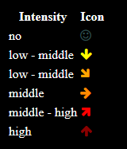

# MMM-pollen
A <a href="https://github.com/MichMich/MagicMirror">MagicMirror</a> module to display current `pollen` intensity and forecast for the next day based on data from the "deutscher wetter dienst" (dwd).

## Preview


## Intensity and related icon


## Using the module


To use this module, add it to the modules array in the `config/config.js` file:
````javascript
modules: [
	{
		module: "MMM-pollen",
		position: "bottom-center",	// This can be any of the regions.
		config: {
			// See 'Configuration options' for more information.
			locationLongitude: 6.77,
			locationLatitude: 51.4,
		}
	}
]
````

## Configuration options

The following properties can be configured:


| Option                       | Default   | Description
| ---------------------------- | --------- | -----------
| `locationLongitude`          |           | Longitude for the location for which the pollen intensity will be shown
| `locationLatitude`           |           | Latitude for the location for which the pollen intensity will be shown
| `noEmptyLines`               | true      | Show only lines in the table for pollen with intensity greater than none.
| `pollenLayers`               | all types | List of pollen (see below) for which the intensity will be shown. Specify as a comma separated list, no spaces between values!

|Possible pollen types:
|----------------------
|`Hasel'Pollenflug_Hasel,
|`Erle'Pollenflug_Erle,
|``Pollenflug_Esche,
|``Pollenflug_Birke,
|``Pollenflug_Graeser,
|``Pollenflug_Roggen,
|``Pollenflug_Beifuss,
|``Pollenflug_Ambrosia

## Installation of module and dependencies

* `git clone https://github.com/devduisburg/MMM-pollen.git` into `~/MagicMirror/modules` directory.

## Add to Config.js

    {
        module: "MMM-pollen",
		position: 'middle_center',
        config: {
			locationLongitude: 6.77,
			locationLatitude: 51.4,
			noEmptyLines: true,
			pollenLayers: "Pollenflug_Hasel,Pollenflug_Erle,Pollenflug_Esche,Pollenflug_Birke,Pollenflug_Graeser,Pollenflug_Roggen,Pollenflug_Beifuss,Pollenflug_Ambrosia"
        }
    },

## Coming soon
- [ ] Retrieve long/latitude from ZIP code
- [ ] Nicer icons
	